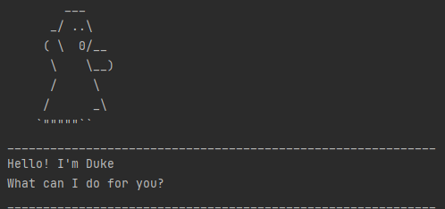

# Duke personal task manager - User Guide

Duke is your personal task manager that can help you keep track of a list of your tasks. It is an automated 'todo' list
that is sure to boost your productivity!

## Quick Start

1. Ensure you have Java 11 installed on your computer, if not please download it using the link: https://www.oracle.com/sg/java/technologies/javase/jdk11-archive-downloads.html
2. Ensure you have a copy of 'duke.jar' on your computer, place it in any empty folder of your choice
3. At the folder containing 'duke.jar', type 'cmd' into the folder path as shown here

4. run the following command in the command prompt: `java -jar duke.jar`
5. On start up, duke will create a text file in the same location to store tasks, or upodate its own data with the data stored in the text file

## features overview

Duke supports _3_ types of tasks: Todo, Deadline & Event
Todo tasks are as the name implies, tasks that you need to do in general, without support for any dates whatsoever
Deadline tasks are tasks that you have to complete by a specific time and date
Event tasks are tasks that occur over a given time period (e.g. having a class from 4pm to 6pm)

Duke supports the tracking of the aforementioned task types, with features as shown below:

1. List tasks that you want to track
2. Adding of tasks to Duke
3. Marking the completion of tasks & vice-versa
4. Removing tasks from list
5. Finding tasks using a keyword
6. Exit

## Usage
Please note that the following commands need not be case-sensitive

### Starting

Upon running the program, Duke will load the tasks that are currently saved under 'data.txt', or create this file if it
does not exist

Sample output of starting screen:
____________________________________________________________
I've added this task:
[T][ ] movie
Now you have 1 tasks in the list
____________________________________________________________
____________________________________________________________
I've added this task:
[D][ ] watch movie (by: 10pm)
Now you have 2 tasks in the list
____________________________________________________________
____________________________________________________________
Hello! I'm Duke
What can I do for you?
____________________________________________________________

### List command

Displays all the tasks that you are currently tracking
Input format: [command]
Output format: [Type of task] [Completion status] [Task details]

Sample input: 
list

Sample output: 
____________________________________________________________
Here are the tasks in your list:
1.[T][ ] movie
2.[D][ ] watch movie (by: 10pm)
3.[E][ ] watch movie antman (from: 5pm to:10pm)
4.[E][X] soc movie night (from: 7pm thursday to:10pm)
____________________________________________________________

### Adding tasks

### Add todo task

Format: [command] [task description]

Sample input:
todo my math homework

Sample output:
____________________________________________________________
I've added this task:
[T][ ] my math homework
Now you have 5 tasks in the list
____________________________________________________________

### Add deadline task

Format: [command] [task description]/[deadline]

Sample input:
deadline my math homework /by tonight 2359

Sample output:
____________________________________________________________
I've added this task:
[D][ ] my math homework  (by: tonight 2359)
Now you have 6 tasks in the list
____________________________________________________________

### Add event task

Format: [command] [task description]/[from]/[to]

Sample input:
event my math homework /from 8pm /to 11pm

Sample output:
____________________________________________________________
I've added this task:
[E][ ] my math homework (from: 8pm to: 11pm)
Now you have 7 tasks in the list
____________________________________________________________

## Marking of tasks

Use the aforementioned 'list' command to list your tasks, then use the integer index of the task to mark the completion
status of a task

### Marking a task as completed

Format: [command] [item index]

Sample input:
mark 1

Sample output:
____________________________________________________________
Nice! I've marked this task as done:
[T][X] movie
____________________________________________________________

### Unmarking a completed task

Format: [command] [item index]

Sample input:
unmark 1

Sample output:
____________________________________________________________
OK! I've marked this task as not done yet:
[T][ ] movie
____________________________________________________________

## Finding related tasks using a keyword

Use a particular keyword to find a list of tasks that contains this keyword

Format: [command] [keyword]

### Finding a keyword that matches at least one item

Sample input:
find math

Sample output:
____________________________________________________________
Here are the matching tasks in your list:
1.[T][ ] my math homework
2.[D][ ] my math homework  (by: tonight 2359)
3.[E][ ] my math homework (from: 8pm to: 11pm)
____________________________________________________________

### Finding a keyword that does not match any item

Sample input:
find science

Sample output:
____________________________________________________________
No item match!
____________________________________________________________

## Exiting

Use the keyword 'bye' to exit the program

format: [command]

Sample input:
bye duke

Sample output:
____________________________________________________________
Bye. Hope to see you again soon!
____________________________________________________________

