# User Guide
Thank you for using Duke. Duke is a command-line interface, personal assistant bot which you can use to help track your various tasks and duties throughout the day.

# Table of contents
1. [Installation](#installation)
2. [Quick Note about Formatting and Inputs](#quick-notes-about-formatting-and-inputs)
3. [Features](#features)
   1. [Tasks](#tasks)
      1. [Todo](#todo)
      2. [Deadline](#deadline)
      3. [Event](#event)
   2. [List](#list)
   3. [Marking Tasks](#marking-tasks)
      1. [Mark Tasks](#mark-tasks)
      2. [Unmark Tasks](#unmark-tasks) 
   4. [Delete](#delete)
   5. [Find](#find)
   6. [Bye](#bye)
   7. [Saving Files](#saving-files)
4. [Command Summary](#command-summary)

# Installation
1. Before installing and using Duke, do note that Java 11 is required. If you do not already have it installed, you can do so [here](https://www.oracle.com/sg/java/technologies/downloads/#java11). 
2. After installing Java 11, please download the .jar file [here](https://github.com/natashatanyt/ip/releases/) and place it in a folder. Doing so ensures that the save-file will not be lost, allowing you to use data that you have previously entered.

   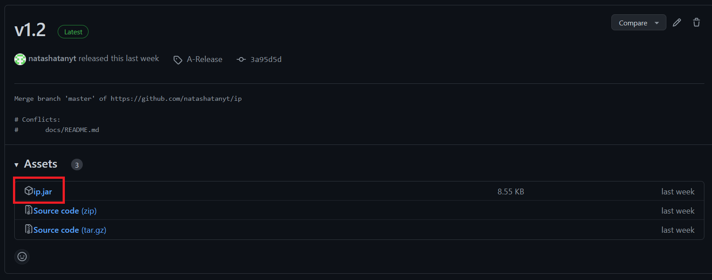
   
   Click on `ip.jar` to automatically download the file. Ensure that it is the latest version. 
3. Open the command terminal and navigate to the folder where the jar file is.
4. Right-click the file and select the "Copy as path" option. 
5. Open a command terminal by entering `cmd` in your start menu.
6. In the terminal, navigate to the location of the folder by doing `cd FILE_PATH`
   1. This step is important as it ensures that the saved tasks file will be saved in the same directory. Otherwise, the file will be stored in the current working directory.
7. Use the command `java -jar ip.jar` to launch Duke. If done correctly, you will see something like this on your first start up:

   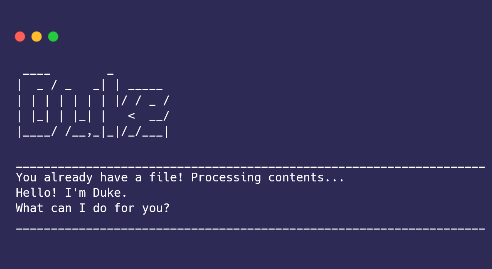

8. When you are done using the app, enter `bye` to shut the application down. This ensures that Duke will save your data, as saving data is only done during the shut-down process. 

# Quick Notes about Formatting and Inputs
1. All words in `UPPER_CASE` are parameters, and all words in `this formatting` are instructions that you can copy directly.
2. There are **no optional parameters**, so each parameter must have an input. Any mistakes will throw an error message to inform you that there has been a mistake, and what the correct format is. 
   1. Do read the user guide carefully as the inclusion of additional parameters may cause Duke to crash. 
3. All command words, such as `deadline` or `unmark`, are case-insensitive: any combination of capitalized and non-capitalized characters will still call the correct command, as long as it is spelt correctly.
4. `DATE TIME` inputs for deadline and event tasks, ie. using the commands `/by`, `/from` and `/to`, will use the format `YYYY-MM-DD HH:MM`, in 24-hour time, such as entering `2023-01-23 23:59` to represent 23 Jan 2023, 11:59pm.
   1. You are required to have both the date and time. Omitting either will cause Duke to throw an error.

# Features 
The following sections will show you the features of Duke and how to use Duke effectively. It is broken up into a few sections to help you find what you need better. These sections are: [tasks](#tasks), [marking tasks](#marking-tasks), [delete](#delete), [search](#search), and [saving files](#saving-files).

## Tasks
Duke has 3 classifications of tasks: [todos](#todo), [deadlines](#deadline) and [events](#event). More details on each task can be found in their individual sections.

Note: For all tasks, the parameters can consist of multiple words, which will be shown in each subsection. 

### Todo
Todos are the most basic form of tasks, consisting of only a description.

The command usage is `todo TASK`, ie. `todo written assignment`.

If the input method is correct, you will see something like this:

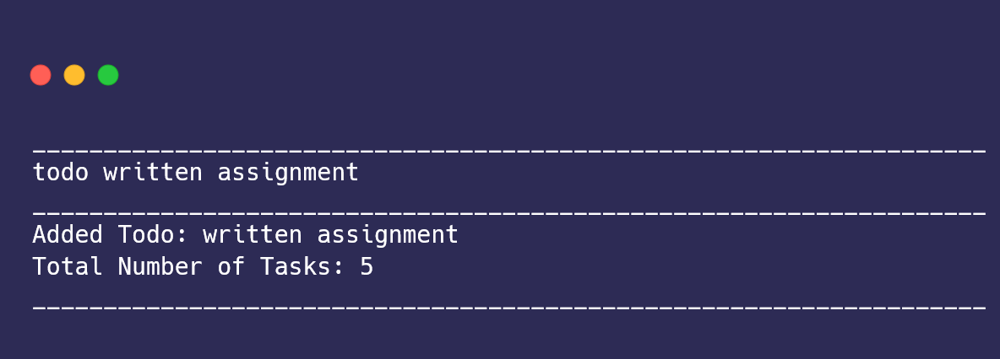

### Deadline
Deadlines consist of a description and a date by which the task has to be completed. 

The command usage is `deadline TASK /by DATE TIME`, ie. `deadline return book /by 2023-12-23 12:55`.

If the input method is correct, you will see something like this:

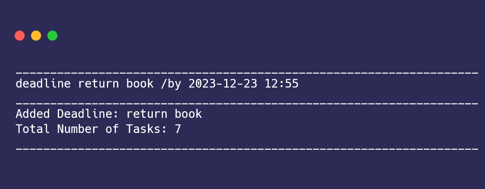

### Event
Events consist of a description, and two times, indicating the start and end of the event.

The command usage is `event TASK /from DATE /to DATE`, ie. `event project meeting /from 2023-11-23 12:55 /to 2023-11-23 15:55`.

If the input method is correct, you will see something like this:

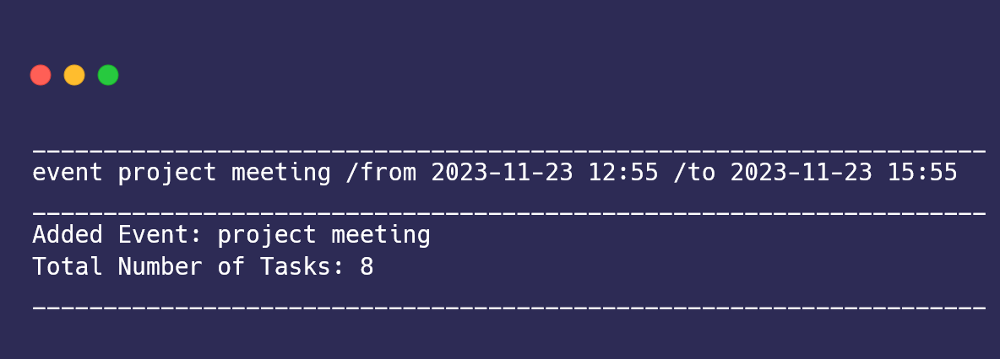

## List
If you want to see all the tasks that Duke has helped you store, you can do so with the command `list`. This is a single word command which has no additional parameters. Any other parameters will be ignored Duke - for example, if you put 'list 1234', Duke will still process the command as 'list' and ignore '1234'.

Your tasks will be printed out by Duke in the same order that you input them, with its index. There are three main sections when your tasks are printed, as shown below:

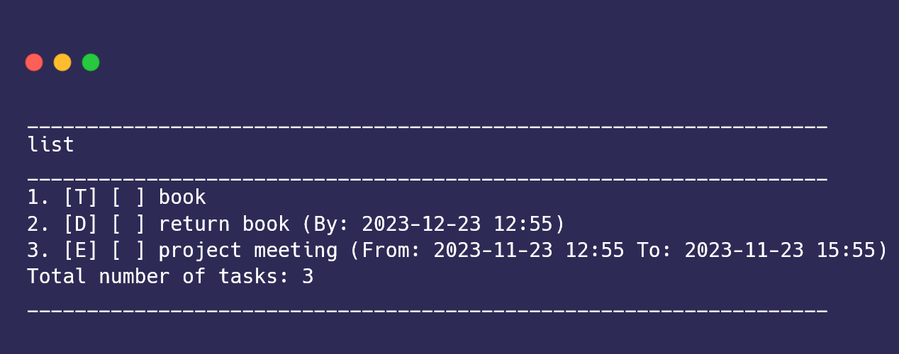

The first section shows the type of task, with 'T' for todo, 'D' for deadline, and 'E' for event. The next shows the completion status of the task, with an 'X' to show the task is complete and a blank space, ' ', to show that the tasks is incomplete. The last section is the description of the task. 

## Marking Tasks
Duke comes with an in-built task tracker, allowing you to mark tasks as completed and uncompleted. By default, tasks are added to the list as incomplete.

To obtain figure out the index of your code, you can use the command [`list`](#list).

### Mark Tasks
After you have completed a task, you can use the command `mark INDEX`, ie. `mark 1`. 

If the input method is correct, you will see something like this:

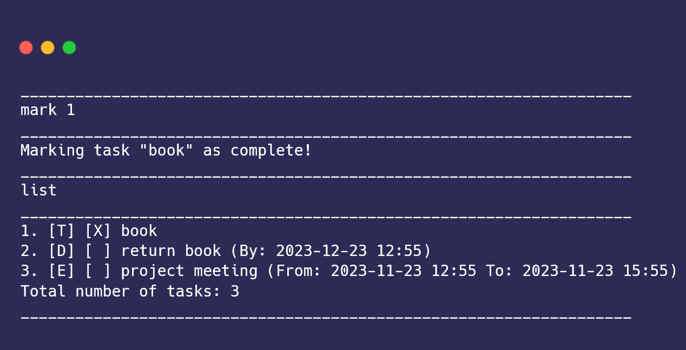

### Unmark Tasks
If you wish to unmark a task, you can use the command `unmark INDEX`, ie. `unmark 1`.

If the input method is correct, you will see something like this:

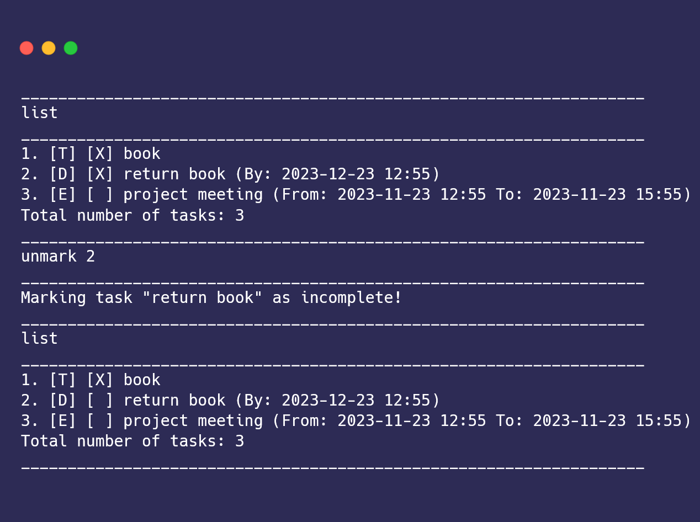

## Delete
Currently, there Duke does not have the ability to edit tasks. If you make a mistake, or want to delete a task, you can do so with this feature. 

The command usage is `delete INDEX`, ie. `delete 1`. 

If the input method is correct, you will see something like this:

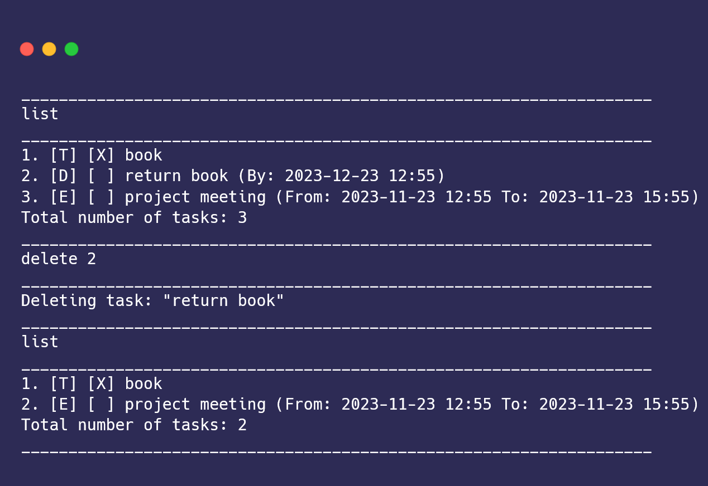

## Find
If you wish to find tasks which contain specific words, you can do so with this feature.

The command usage is `find DESCRIPTION`. Currently, Duke is unable to search by time. If you were to try searching for tasks due on `2023-11-23`, Duke will not be able to print out tasks for you, unless it is part of the task's description. 

If the input method is correct, you will see something like this:

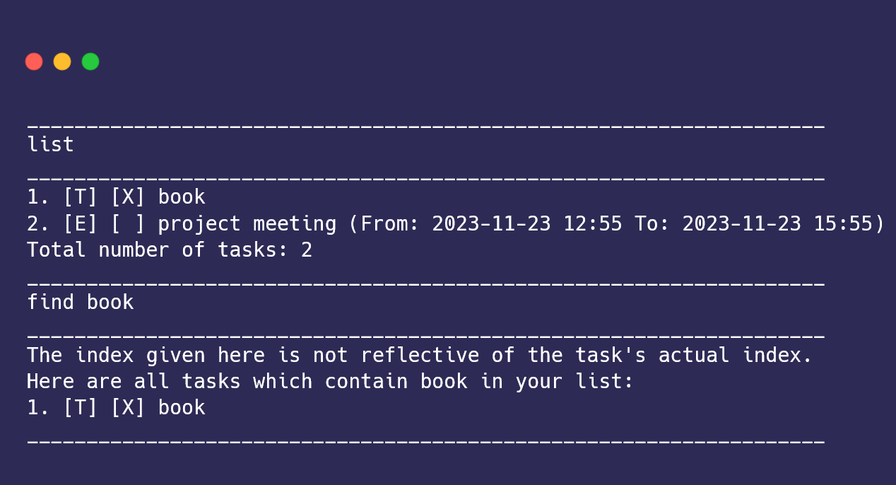

## Bye
This command is used when you are done using Duke. It is important to send the command as it ensures that Duke will save the current list.

The command usage is `bye`. 

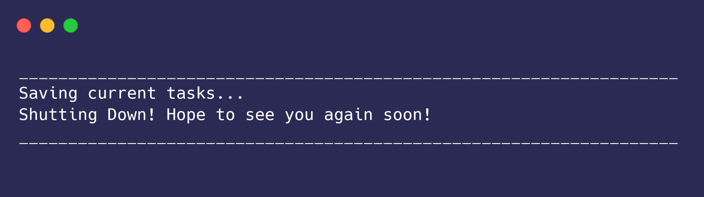

## Saving Files
On the first creation of Duke, the file will be created in the current working directory. As mentioned, it is recommended to put the `.jar` file in the same directory as the save file for your reference, if needed.

After entering the exit command, `bye`, Duke will save the contents into a text file (Duke.txt). The file will save each task on a new line, with the order of task type, completion status, and description. Each section is segmented by a slash (`/`), such as the following example:

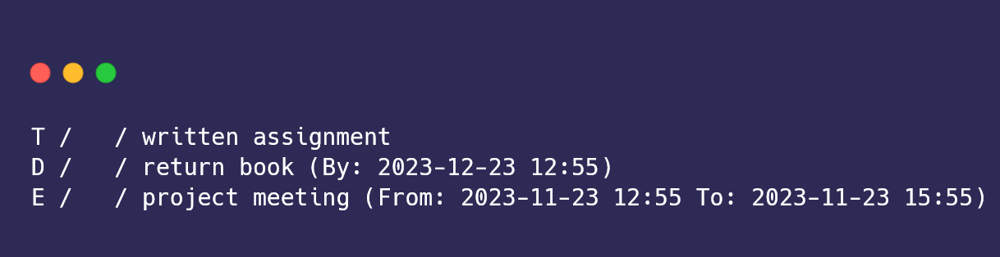

If you want to edit the save file, you may do so, but note that improper edits may cause Duke to crash. If Duke fails to read the file, you can delete the file and restart the application. 

# Command Summary
This section will give the full list of features that Duke has. If you want to see more details, you can refer to the [Table of Contents](#table-of-contents) to navigate to the section you want.

| Name of Command   | General Format                   | Examples                                                            |
|-------------------|----------------------------------|---------------------------------------------------------------------|
| Creating Todo     | `todo TASK`                      | `todo written assignment`                                           |
| Creating Deadline | `deadline TASK /by DATE`         | `deadline return book /by 2023-12-23 12:55`                         |
| Creating Event    | `event TASK /from DATE /to DATE` | `event project meeting /from 2023-11-23 12:55 /to 2023-11-23 15:55` |
| List              | `list`                           | `list`                                                              |
| Mark Tasks        | `mark INDEX`                     | `mark 1`                                                            |
| Unmark Tasks      | `unmark INDEX`                   | `unmark 1`                                                          |
| Delete            | `delete INDEX`                   | `delete 1`                                                          |
| Find              | `find DESCRIPTION`               | `find book`                                                         |
| Bye               | `bye`                            | `bye`                                                               |

# Conclusion
Thank you for your interest in Duke! If you have any issues, please reach out to me on Github!
