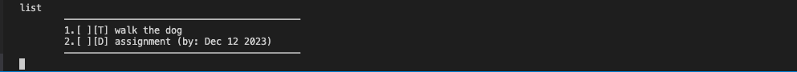
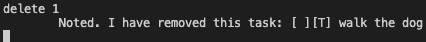
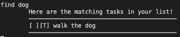

# **Duke User Guide**
### Duke is a desktop application for managing tasks, used through the Command Line Interface (CLI). 
 

* ### Quick Start
* ### Features
  * #### Add todo: `todo`
  * #### Add deadline: `deadline`
  * #### Add event: `event`
  * #### Display taskslist: `list`
  * #### Mark task: `mark`
  * #### Unmark task: `unmark`
  * #### Delete task: `delete`
  * #### Find task: `find`
  * #### Save/ Exit Duke: `bye`

 

# Quick Start 

### 1. Ensure you have Java 11 installed in you Computer. 

### 2. Downlod the latest ip.jar from [here](https://github.com/TayJiunYuan/ip).

### 3. Copy the jar file into a new folder.

### 4. Open a terminal and cd into the new folder. Use `java -jar ip.jar` to run Duke.

### 5. Refer to the Features below for each command.

 

# Features 
## Add todo: `todo`

 

#### Adds a Todo task into the taskslist.
#### Format: `todo TASK_NAME`
#### Examples:
>* #### `todo walk the dog`
>* #### `todo do homework`

 
 

## Add deadline: `deadline`

 

#### Adds a Deadline task into the taskslist.
#### Format: `todo TASK_NAME /by yyyy-mm-dd`
#### Examples:
>* #### `deadline assignment /by 2021-12-12`
>* #### `deadline pay the bills /by 2023-04-11`

 
 

## Add event: `event`

 

#### Adds an Event task into the taskslist.
#### Format: `event TASK_NAME /from START_DATE /to END_DATE`
#### Examples:
>* #### `event science lesson /from 4pm /to 6pm`
>* #### `event camping trip /from 4th Nov /to 6th Nov`

 
 

## Display taskslist: `list`

 

#### Displays all tasks and their corresponding status.
#### Format: `list`
#### Examples:

 
 

## Mark task: `mark`

 

### Mark task as done by index in taskslist.
### Format: `mark INDEX`
### Examples:
>* #### `mark 1`

 
 

## Unmark task: `unmark`

 

#### Unmark task by index in taskslist.
#### Format: `unmark INDEX`
#### Examples:
> * #### `unmark 1`

 
 

## Delete task: `delete`

 

#### Delete task by index in taskslist.
#### Format `delete INDEX`
#### Examples: 
> * #### `delete 1`

 
 

## Find task: `find`

 

#### Find task by name (case sensitive) in tasklist.
#### Format: `find TASK_NAME`
#### Examples: 
> * #### `find science`
> * #### `find assignment`

 
 

## Save/ Exit Duke: `bye`

 

#### Saves tasks and exits the program.
#### Format: `bye` 

 

