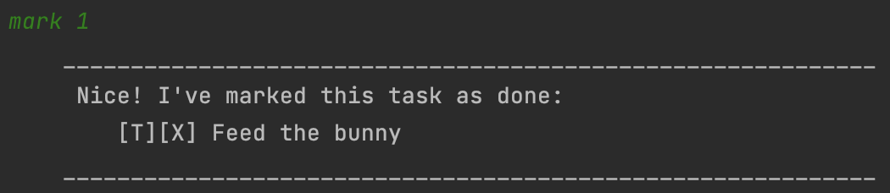
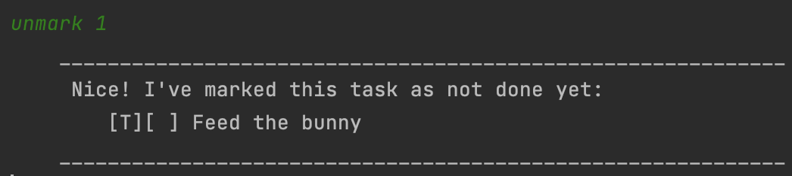

# Bunny User Guide

## Features 

### Tracking Tasks

Bunny can track a list of Todos, Deadlines, and Events for you. You can add and [delete](#delete---remove-task-from-the-list) tasks from a list.

[Todos](#todo---create-a-new-todo) are basic tasks with a name.

[Deadlines](#deadline---create-a-new-deadline) are tasks with a name and a due date.

[Events](#event---create-a-new-event) are tasks with a name as well as start and end dates.

### Marking

Bunny can mark any of your tasks as [done](#mark---set-task-as-done) or [not done](#unmark---set-task-as-not-done).

### List

Bunny can display a [list](#list---list-tasks) of all your tasks.

### Find

Bunny can display a [list](#find---list-tasks-with-a-specific-keyword) of your tasks whose names contain a certain keyword.

### Save File

Bunny will automatically save your existing tasks to a file in your home directory called `bunny.aof`.
The save data will automatically be loaded when you next start the application.

## Usage

### Usage Specification Format
Positional arguments follow directly after the command name.

`[value]` means that a positional argument is expected.

Flag arguments follow after the positional argument, or directly after the command name if there is no positional argument.
They can be specified in any order.
The value of the argument is prefixed by a forward slash followed by the name of the argument.

`/name [value]` means that a flag argument with the name `name` is expected.

### Date Format
If the argument is prefixed with `DATE` (for example: `DATE_by`), then you may **optionally** specify the date in
`YYYY-MM-DD` format. Bunny will then output a human-readable date when displaying that task.

### Control
#### `bye` - Exit the app

Exits the app

Usage:

`bye`

Expected outcome:
```
Bye. Hope to see you again soon!
```

Example:


### Creating Tasks
#### `todo` - Create a new Todo

Creates a new Todo and adds it to your task list

Usage: 

`todo [name]`

Expected outcome:
```
I've added ths task: [T][ ] ???
Now you have ??? tasks in the list.
```

Example:


#### `deadline` - Create a new Deadline

Creates a new Deadline and adds it to your task list

Usage:

`deadline [name] /by [DATE_by]`

Expected outcome:
```
I've added ths task: [D][ ] ??? (by: ???)
Now you have ??? tasks in the list.
```

Example:


#### `event` - Create a new Event

Creates a new Event and adds it to your task list

Usage:

`event [name] /from [DATE_from] /to [DATE_to]`

Expected outcome:
```
I've added ths task: [E][ ] ??? (from: ??? to: ???)
Now you have ??? tasks in the list.
```

Example:


### Displaying tasks
#### `list` - List tasks

List existing tasks

Usage:

`list`

Expected outcome:
```
1. ???
2. ???
3. ???
...
```

Example:


#### `find` - List tasks with a specific keyword

Find existing tasks whose name contains a specific keyword (can be multiple words long)

Note: the keyword is case senstive

Usage:

`find [keyword]`

Expected outcome:
```
1. ???
2. ???
3. ???
...
```

Example:


### Modifying tasks
Note: the `task_index` argument used for these commands should be based on the order returned by the
`list` command, not the `find` command.

#### `mark` - Set task as done

Set a task as done based on the index in the task list.

Usage:

`mark [task_index]`

Expected outcome:
```
Nice! I've marked this task as done:
???
```

Example:


#### `unmark` - Set task as not done

Set a task as not done based on the index in the task list.

Usage:

`unmark [task_index]`

Expected outcome:
```
Nice! I've marked this task as not done yet:
???
```

Example:


#### `delete` - Remove task from the list

Remove a task based on the index in the task list.

Usage:

`delete [task_index]`

Expected outcome:
```
Noted. I've removed this task:
???
Now you have ??? tasks in the list.
```

Example:

